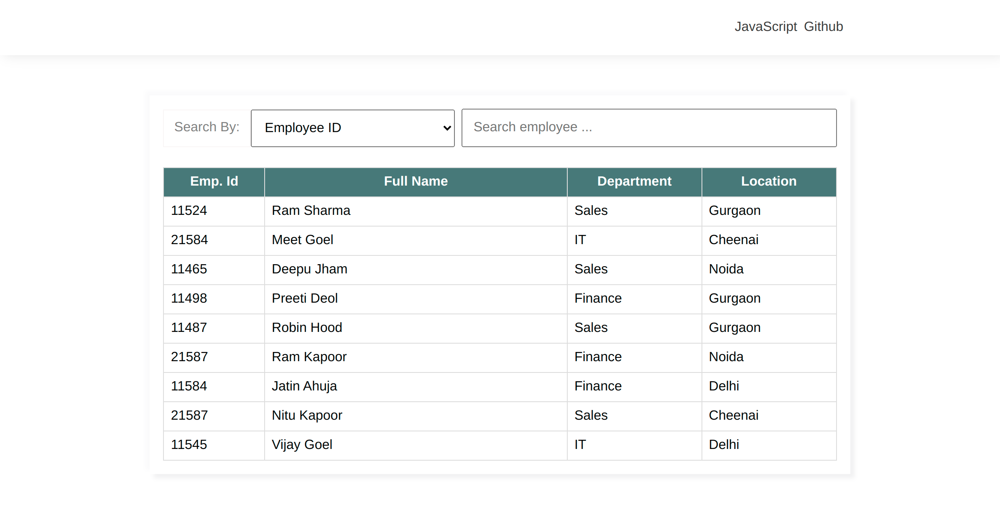

## JavaScript Search Bar 

- Search & Filter record from the table using Vanilla JavaScript

| Project | Tech Stack | Source Code | Link |
| --- | --- | --- |--- |
| Search & Filter Data| Vanilla Javascript | <ul><li>- [x] [HTML](index.html)</li><li>- [x] [CSS](assets/css/style.css)</li><li>- [x] [JavaScript](assets/js/script.js)</li></ul> |[➥Live Preview](https://deltanode.github.io/100DaysofCode/02-filter-table/) |


## Preview



## Project Structure 📂
```
├── index.html
├── assets
│   ├── css
│   │   └── style.css
│   ├── js
│   │   └── script.js
│   └── img
└── README.md
```
