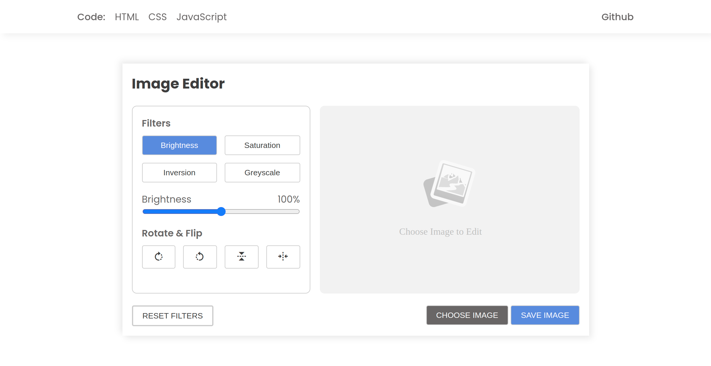

# Image Editor

- An Image Editor using HTML, CSS and JavaScript.
- Compatible with all mobile devices and with a beautiful and pleasant user interface.


## Quick Reference

| Project | Tech Stack | Source Code |Action |
| --- | --- | --- |--- |
| Image Editor | Vanilla Javascript | <ul><li>- [x] [HTML](index.html)</li><li>- [x] [CSS](assets/css/style.css)</li><li>- [x] [JavaScript](assets/js/script.js)</li></ul> | [🔴 Live Preview](https://deltanode.github.io/100DaysofCode/03-image-editor/) |

## Preview


## Project Structure 📂
```
├── index.html
├── assets
│   ├── css
│   │   └── style.css
│   ├── js
│   │   └── script.js
│   └── img
└── README.md
```
